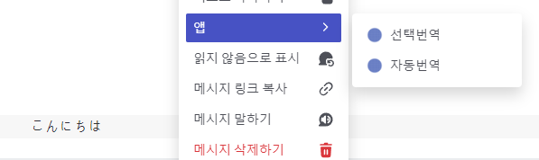

# discord_translation_bot

서버에서 메시지를 쉽게 번역하기 위해 만든 봇 입니다.

# 봇 사용방법

- 번역하고 싶은 메시지를 우클릭하고, 앱에서 `선택번역`, `자동번역`을 선택합니다.

- ## 자동번역

    사용자가 현재 사용하고있는 디스코드 언어에 따라서 번역합니다.

- ## 선택번역

    아래 사진과 같이 목록에서 번역할 언어를 선택하여 번역합니다.
    

# 도움이 필요할 때

[여기](https://github.com/gudtldn/discord_translation_bot/issues)에서 새로운 이슈를 남겨주세요.
